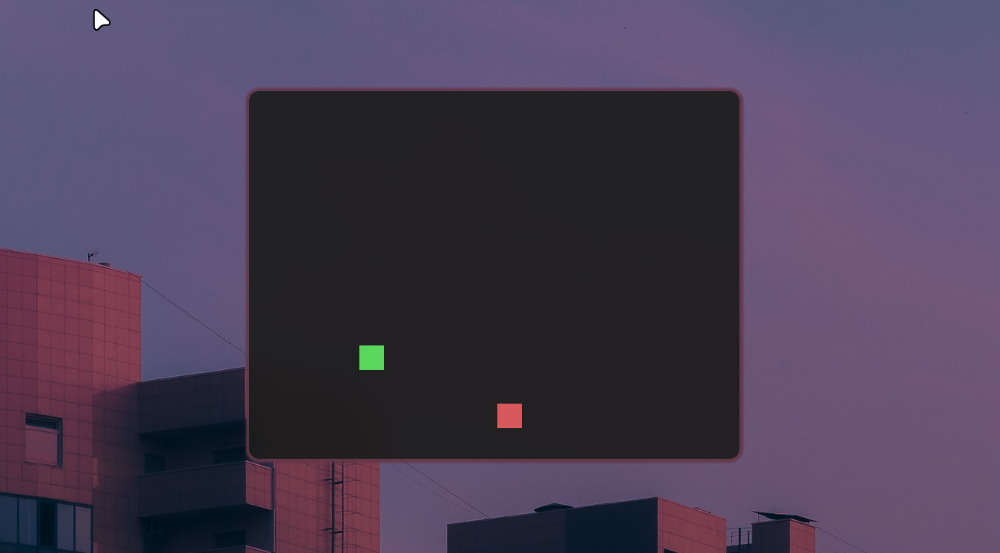
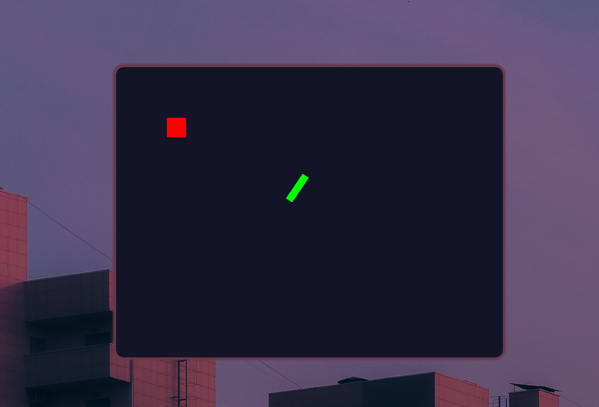

# ZapEngine


ZapEngine is a lightweight, fully functional 2D game engine built in Go, powered by [Ebitengine](https://ebitengine.org/) under the hood. It utilizes a robust **Entity-Component-System (ECS)** architecture, scene management, and built-in essential systems to accelerate your game development process.

## Features

- **Entity-Component-System (ECS)**: A flexible and generic data-oriented design pattern.
  - Entities are lightweight numeric IDs.
  - Components are standard Go structs.
  - Systems contain the logic to process entities with specific components.
- **Scene Management**: Easily modularize your game states (e.g., Main Menu, Level 1, Game Over) and switch between them.
- **Built-in Components**: Comes with standard `Transform` and `Sprite` components.
- **Built-in Systems**: Includes a `RenderSystem` that automatically draws entities that have both a `Transform` and a `Sprite`.
- **Input Wrapper**: A simplified wrapper over Ebitengine's input state for querying keyboard and mouse interactions.
- **Examples**: Built-in examples demonstrating different features of the engine.

## Installation

Ensure you have a working Go environment (v1.21 or later is recommended).

```bash
go get github.com/grapefizz/zapengine
```

**Note for Linux users**: Ebitengine requires certain system libraries to be installed (e.g., OpenGL, ALSA, X11).
- **Arch Linux**: `sudo pacman -S git go pkgconf alsa-lib libxcursor libxi libxinerama libxrandr mesa glibc base-devel`
- **Ubuntu/Debian**: `sudo apt install libgl1-mesa-dev libxcursor-dev libxi-dev libxinerama-dev libxrandr-dev libxxf86vm-dev libasound2-dev pkg-config`

For other operating systems, refer to the [Ebitengine installation guide](https://ebitengine.org/en/documents/install.html).

## Usage

Here is a minimal example of starting the engine:

```go
package main

import (
	"log"
	"github.com/grapefizz/zapengine"
	"github.com/grapefizz/zapengine/ecs"
	"github.com/hajimehoshi/ebiten/v2"
)

type MyScene struct {
	world *ecs.World
}

func (s *MyScene) Load() {
    s.world = ecs.NewWorld()
    // Setup entities, components, and systems here
}

func (s *MyScene) Unload() {}

func (s *MyScene) Update() error {
	return s.world.Update()
}

func (s *MyScene) Draw(screen *ebiten.Image) {
	s.world.Draw(screen)
}

func main() {
	engine := zapengine.NewEngine(800, 600, "My Awesome Game")
	engine.SetScene(&MyScene{})

	if err := engine.Run(); err != nil {
		log.Fatal(err)
	}
}
```

## Running the Examples

ZapEngine comes with several built-in examples that demonstrate its features. You can run them directly from the repository:

1. **Basic Demo**
   ```bash
   go run ./cmd/example
   ```
2. **Bouncing Sprites** (Velocity systems and screen boundaries)
   ```bash
   go run ./cmd/bouncing
   ```
3. **Input Handling** (Keyboard and Mouse state queries)
   ```bash
   go run ./cmd/input
   ```
4. **Scene Switching** (Transitioning between different game scenes)
   ```bash
   go run ./cmd/scenes
   ```
5. **Stress Test** (Rendering and updating 10,000 entities)
   ```bash
   go run ./cmd/stress
   ```

### Screenshots

Here are some screenshots of the engine in action:






